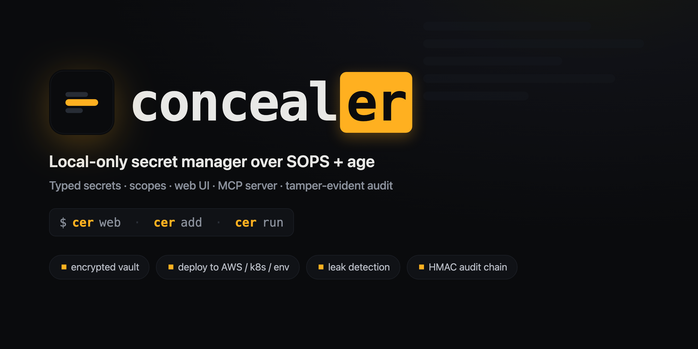

<p align="center">
  
</p>

# conceal**er**

> **Local‑only, single‑file secret manager for the AI‑coding era.**
> Encrypted with [SOPS](https://github.com/getsops/sops) + [age](https://github.com/FiloSottile/age).
> No cloud, no telemetry, no account. One master password. CLI · Web UI · MCP.

`concealer` is a thin, auditable wrapper around two battle‑tested tools — it does **not** implement its own cryptography. Everything is encrypted by `sops`/`age`; concealer only adds the UX: typed secrets, scoping, tags, a professional web UI, tamper‑evident audit logs, and an MCP server so AI agents can *use* secrets without ever *seeing* them.

---

## Why does this exist? (the motivation)

Modern coding assistants — Claude Code, Codex, Gemini CLI, opencode, Cursor — are wonderful, but they read your project files. That means the moment an API key lands in a `.env`, a `credentials.json`, or gets pasted into a chat, it can be:

- read by the agent and sent to a model provider,
- captured in logs/telemetry of whatever tool you're using,
- committed to git by accident,
- copied across dozens of repos with the same `OPENAI_API_KEY` name and no way to tell them apart.

I didn't want a **cloud** secret manager (Doppler, Infisical, Vault, 1Password) because:

1. **Local‑only, provably offline.** Secrets never leave my machine. No account, no sync server, no telemetry — you can verify with a firewall that nothing phones home.
2. **Portable, not machine‑bound.** The vault is decryptable on any machine with just the **master password** (age passphrase) — not tied to this laptop's Keychain/TPM. Copy the files, type the password, done.
3. **Git‑friendly & inspectable.** The encrypted vault is a plain SOPS file you can commit; the tool is a single readable script, not a black box.
4. **AI‑safe by design.** Agents get an MCP server that can **list** names and **inject** secrets into a command's environment — but the plaintext values are redacted from output. The agent runs `psql`/`curl` with the credentials without the key ever appearing in the transcript.
5. **One place, many projects.** The same value used across many repos is disambiguated by `tenant / project / environment / repo` dimensions instead of a single ambiguous name.

If you've ever pasted a secret into a chat window and immediately regretted it — that's the itch this scratches.

---

## Built on SOPS + age (credit where due)

concealer is **not** a crypto project. It delegates 100% of encryption to:

| Tool | Repo | Role in concealer |
|------|------|-------------------|
| **SOPS** | https://github.com/getsops/sops | Encrypts/decrypts the vault (`secrets.enc.yaml`). Per‑value AES‑256‑GCM, git‑friendly. |
| **age** | https://github.com/FiloSottile/age | The encryption backend (X25519). The private key is itself passphrase‑wrapped (scrypt) for a portable backup. |

Why this stack: SOPS is a CNCF project used by thousands of teams; age is a modern, audited, boring‑on‑purpose encryption tool by Filippo Valsorda. Reusing them means the security‑critical code is the part that has already been reviewed by the world — concealer is just glue. This is deliberate: **the laziest secure design is the one where you write the least security code.**

---

## How it works

```
┌─────────────┐   CLI / Web UI / MCP        ┌──────────────────────┐
│  concealer  │ ─────────────────────────▶  │ secrets.enc.yaml     │
│ (1 script)  │   load → dict → save         │ (SOPS + age, on disk)│
└─────┬───────┘                              └──────────────────────┘
      │ delegates all crypto
      ▼
   sops ── age ── keys/age-key.txt        (0600 working key)
                  keys/age-key.txt.age    (master-password wrapped, portable)
                  keys/master.json        (scrypt verifier for the UI)
                  keys/audit.log          (HMAC-chained, tamper-evident)
```

- **Vault**: one encrypted JSON (stored as YAML by SOPS). Each secret is a typed record with dimensions, tags, url, notes.
- **Master password**: verified via a stdlib `scrypt` hash (`keys/master.json`) — no terminal prompt, no tty games. The same password wraps the age key for portability.
- **Audit**: every access (CLI/Web/MCP) is appended to an HMAC‑chained log — altering or deleting any line breaks the chain.

---

## Install

```bash
# prerequisites
brew install sops age            # macOS (or your package manager)

# get concealer
git clone https://github.com/fxerkan/concealer.git
cd concealer
ln -sf "$PWD/concealer" ~/bin/concealer     # optional: put on PATH
ln -sf "$PWD/concealer" ~/bin/cer           # optional: short alias — `cer web`, `cer add`, `cer run`

# first-time setup — generates keys, asks for a master password
concealer init      # or: cer init
```

Requires Python 3 (stdlib only — no `pip install`), plus `sops`, `age`, and `expect` (ships with macOS/most Linux).

---

## Usage

### CLI
```bash
concealer set --name OPENAI_API_KEY --project proj-a --env prod 'sk-...' --tags ai
concealer set --name MAIN_DB --type database --tenant acme --project billing --env prod \
    host=db.acme.io port=5432 database=billing username=svc password=secret auth_type=password
concealer list --type database --tenant acme
concealer search OPENAI
concealer get --name OPENAI_API_KEY --project proj-a --env prod
concealer rotate --name OPENAI_API_KEY --project proj-a        # 32-byte random if no value
concealer rm --name OLD_KEY --project proj-a
concealer run --project proj-a --env prod claude               # inject into env, run tool
concealer audit                                                # recent audit entries
concealer audit verify                                         # chain integrity
```

### Scopes & inheritance
Every secret carries `tenant / project / environment / repo`. Empty = wildcard (a default). On `run`, the **most‑specific** match wins: `acme/proj-a/prod` overrides `proj-a` overrides `global`. Unspecified dimensions on `run` are auto‑detected from the current git repo.

### Secret types
| Type | Fields |
|------|--------|
| `api_key` | `value` |
| `database` | host, port, database, schema, username, password, auth_type, jdbc_url |
| `website` | web_url, username, password |
| `custom` | any key/value you define |

Secret‑ish fields (password/value/token…) are masked in lists and revealed only on demand (audited).

### Web UI — `concealer web`
Opens **http://127.0.0.1:8787** (localhost only). Features:
- **TR / EN** interface toggle (top‑right)
- Full **CRUD** with type‑aware forms
- Search + tenant/project/environment/repo/tag/type filters
- **Copy to clipboard with auto‑clear** (20s) · password **show/hide** toggle
- Metadata: url, tags, notes
- **Auto‑lock on idle** (default 300s, `CONCEALER_IDLE=…` to change)
- **Audit Log viewer**: filter by action/source/key/date, pagination, row detail, **chain verification**, CSV/JSON export

### MCP (AI agents) — `concealer mcp`
Register once, available in every session:
```bash
claude mcp add --scope user concealer -- /path/to/concealer/concealer mcp
```
Tools exposed to the agent:
- `list_secrets` / `search_secrets` — names, types, scopes, tags (**never values**)
- `run_with_secrets` — runs a command with secrets injected into env; **values are redacted** from the returned output

The agent can use a DB password to run a query, but the password never appears in its context. Every MCP access is written to the audit log with `source=mcp`.

---

## Portability (move to another machine)

```bash
# copy: secrets.enc.yaml + keys/age-key.txt.age + .sops.yaml
age --decrypt -o keys/age-key.txt keys/age-key.txt.age   # asks master password
chmod 600 keys/age-key.txt
concealer list                                            # works — machine-independent
```
The vault is bound to a **password**, not to this machine's hardware.

---

## Security model & notes

- Encryption: AES‑256‑GCM (SOPS) over age X25519. Key derivation for the portable backup + UI verifier: **scrypt / age‑scrypt**.
- `keys/age-key.txt` is a 0600 working key (standard SOPS practice); `keys/age-key.txt.age` is its passphrase‑wrapped, portable form.
- **The audit log holds key *names* and actions, not values** — it is tamper‑evident (HMAC chain), not secret.
- The web UI binds to `127.0.0.1` only and is single‑user; treat it as a local convenience, not a hardened multi‑user server.
- **Nothing in `keys/`, `secrets.enc.yaml`, or `.sops.yaml` is committed** — see `.gitignore`. This repo ships the *tool*, never a vault.

## Change the master password
```bash
concealer passwd     # re-wraps the portable backup + updates the UI verifier
```

## License
MIT.

---

*concealer is glue over [SOPS](https://github.com/getsops/sops) and [age](https://github.com/FiloSottile/age). All the hard cryptography is theirs; the laziness is mine.*
